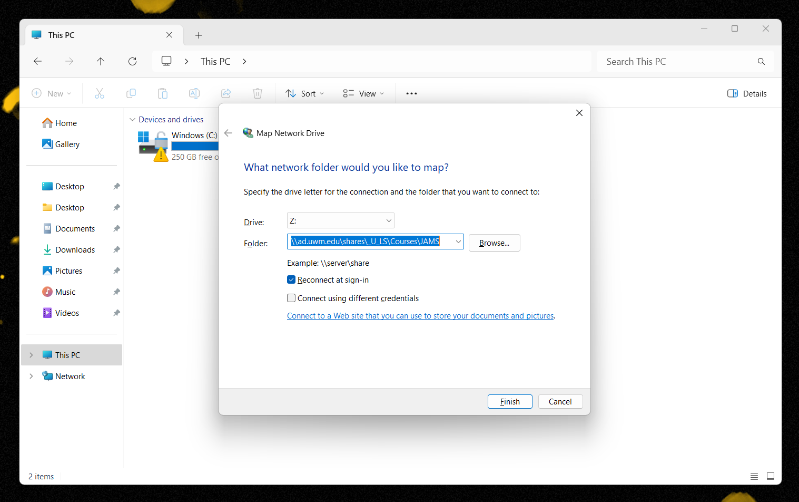

# Connecting to Your Class Folder

Before you begin working in **Audition**, you'll need to connect to your class folder. Your project folder (and all audio files related to your project) will live in this location.

1. **Right-click** the **Start** button (bottom middle of screen) and select **File Explorer.**
2. In the **File Explorer** window, select **This PC** (on left.)&#x20;
3. Right-click **This PC** (on left.) In the fly-out menu that appears, select **Map network drive**.
4. In the **Map Network Drive** box, leave the default **Drive** letter selected. In the **Folder** field, copy and paste the following string (be sure to copy the full string): \
   \
   `\\ad.uwm.edu\shares\_U_LS\Courses\JAMS`\

5. Click **Finish**. Your class folder will appear in the **This PC** area as a connected drive (probably the **Z** drive.)&#x20;
6. If necessary, [navigate](https://app.gitbook.com/@techresources/s/file-and-folder-management-windows-edition/navigating-folder-tree) to your class folder.

<figure><figcaption>
Connecting to your class folder on a PC.
</figcaption></figure>

