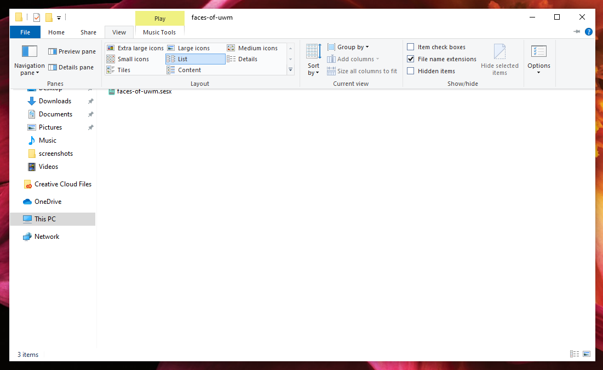

# Displaying file extensions

Some computers do not display file extensions \(.wav, .mp3, etc.\) by default. If your computer does not have this featured turned on, you should active it before working with Audition.

1. In a File Explorer window, click **View**.
2. Make sure **List** is selected.
3. Click the checkbox next to **File name extensions** to display file extensions.

