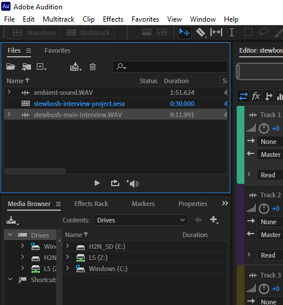

# Importing WAV Files Into Audition

After copying your WAV files into your project folder, you’ll import them into **Audition**.

1. Go to **File** on the menu bar, choose **Import** and select **File**.&#x20;
2. In the **Import File** dialog box, [navigate](https://app.gitbook.com/@techresources/s/file-and-folder-management-windows-edition/navigating-folder-tree) to your project folder and select your WAV file (or files.) Press and hold the **Ctrl** key (on keyboard) to select multiple WAV files.
3. Click **Open**. The WAV file (or files) will appear in the **Files** panel (upper-left).

<figure><figcaption>
Importing WAV files into Adobe Audition.
</figcaption></figure>
