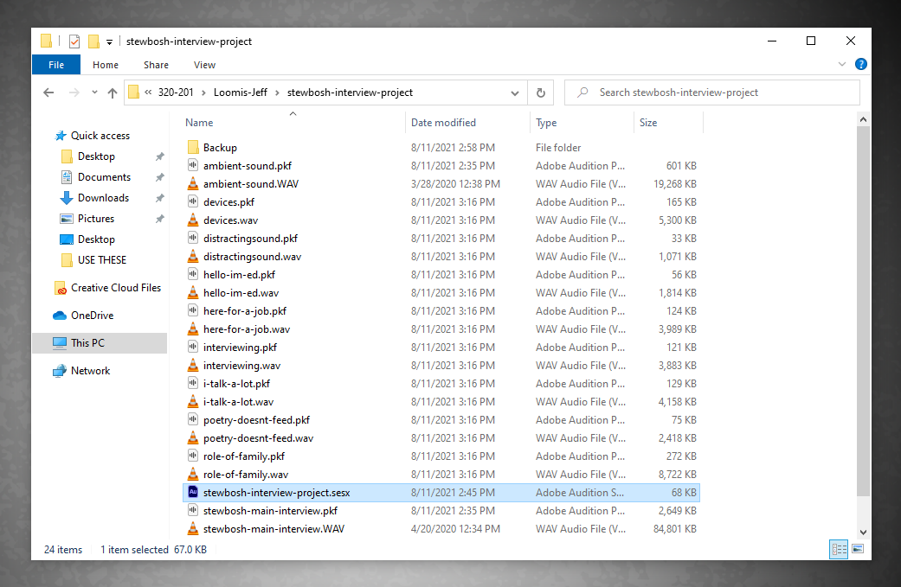

# Opening an Existing Multitrack Session

To continue working on an existing multitrack session, you'll open the SESX file in your project folder.

**Note**: When you open an existing multitrack session, only WAV files that have been added to audio tracks will appear in the **Files** panel (upper-left.)

To work with WAV files that were previously saved or copied to your project folder, you'll need to import those WAV files into your multitrack session.

1. [Navigate](https://app.gitbook.com/@techresources/s/file-and-folder-management-windows-edition/navigating-folder-tree) to and open your project folder.&#x20;
2. Double-click your SESX file to open your multitrack session.&#x20;
3. To continue working with previously saved WAV files that are in your project folder, [import the WAV files into Audition](importing-wav-files.md).

