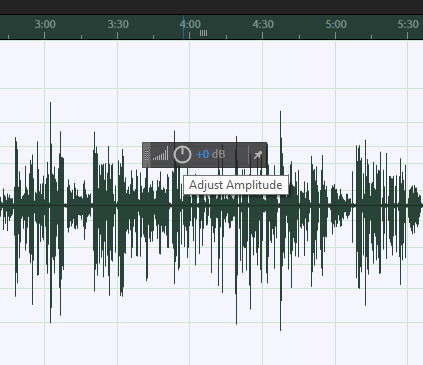

# Raising or Lowering the Audio Level of a WAV File

During playback, your audio levels should fall somewhere between -12 and -6 decibels in the **Levels** panel (bottom of screen.) If your audio levels are consistently low or high, you can select the entire waveform and adjust the overall amplitude of the WAV file.

1. In the waveform editor, go to **Edit** on the menu bar. &#x20;
2. From the **Edit** menu, go to **Select** and then choose **Select All**. The waveform will appear highlighted.&#x20;
3. Use the **Adjust Amplitude** tool to bring your overall audio level up or down.&#x20;
4. Play your audio again. Your audio levels should fall somewhere between -12 and -6 decibels.&#x20;
5. If you make a mistake while adjusting your amplitude, go to **Edit** and select **Undo**.

