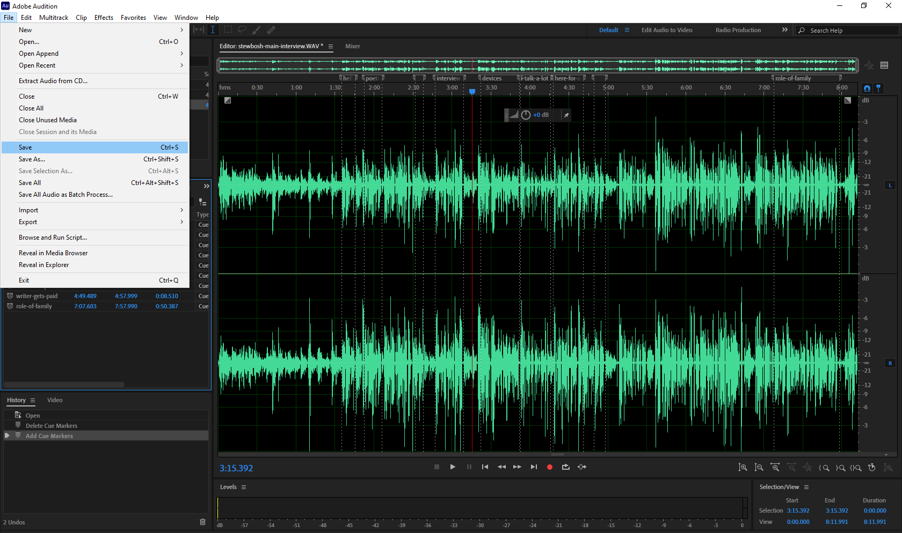

# Saving a WAV File with Range Markers

After creating your **range markers**, you’ll need to save your work. This will add all of your **range markers** to your WAV file.

* In the Waveform Editor, go to **File** on the menu bar and choose **Save**. Your WAV file will save to its original location. The **range markers** are now part of the WAV file.

