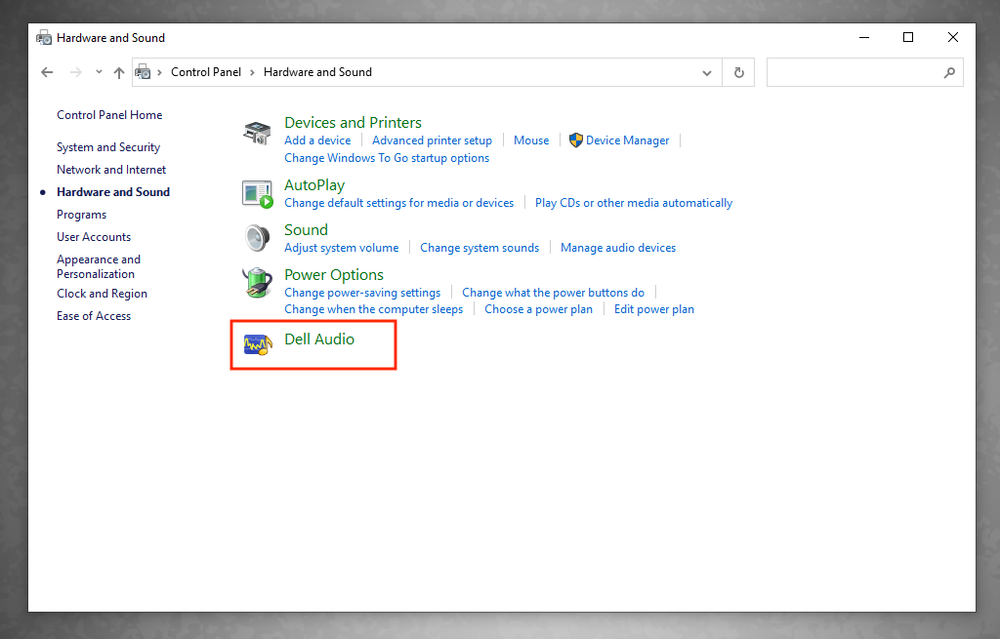

# Audio Sounds Like It's in an Auditorium

### Bolton 296

1. In the **Windows search field** (lower left), search for **Control Panel**.
2. In the **Control Panel** window, click **Hardware and Sound**.
3. In the **Hardware and Sound** window, click **Sound**.
4. In the **Sound** window, select **Headphones** and then click the **Properties** button.
5. In the **Headphones Properties** window, click the **Advanced** tab.
6. In the **Advanced** tab, deselect **Enable audio enhancements** and then click **OK**.
7. In the **Sound** window, click **OK**.

### Bolton 510

* In the **Windows search field** (lower-left corner), search for **Control Panel**.
* In the **Control Panel** window, click **Hardware and Sound**.
* In the **Hardware and Sound** window, click **Dell Audio** (see image below).
* In the **Dell Audio** window, click **Main**.
* Set the **Speaker Enhancement** toggle button to **Off**.
* When finished, click the **close** button (upper-right corner) to exit the **Dell Audio** window.&#x20;

<figure><figcaption></figcaption></figure>

