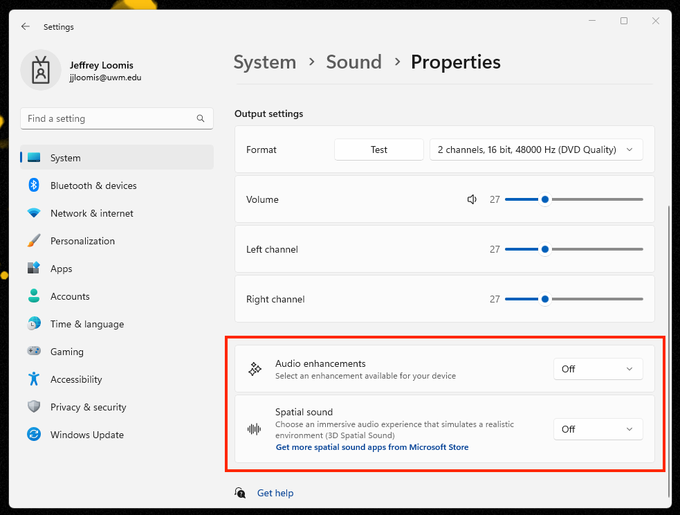

# Audio Sounds Like It's in an Auditorium

###

1. If you haven't already done so, connect your headphones to the computer.&#x20;
2. In the **Windows search field** (bottom center of screen), search for **Sound Settings**.
3. In the **Sound Settings** window, click **Headphones**.
4. In the **Output settings** area, click scroll to **Audio enhancements**.&#x20;
5. Click the **Audio enhancements** drop-down list and select **Off**.
6. If necessary, click the **Spatial sound** drop-down list and select **Off**.&#x20;
7. When finished, close the **Sound Settings** window.&#x20;

<figure><figcaption></figcaption></figure>
