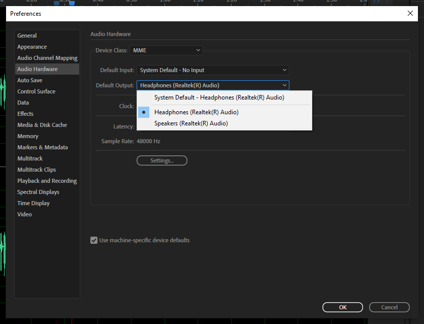

# Changing Audio Output (Headphones or Speakers)

1. **Important**: If you're using headphones to listen to your project, you'll need to connect your headphones before proceeding with the steps below.
2. Go to **Edit** (on menubar) and select **Preferences**.
3. In the **Preferences** fly-out menu, select **Audio Hardware**.
4. Using the **Default Output** drop-down list, select your output source (headphones or speakers.)
5. After changing the output source, an **Audition** dialog box will appear. Click **Yes**.
6. When finished, click **OK**.
7. **Note**: If you're using headphones, you may need to make sure [audio enhancements are disabled](audio-sounds-like-its-in-an-auditorium.md).

